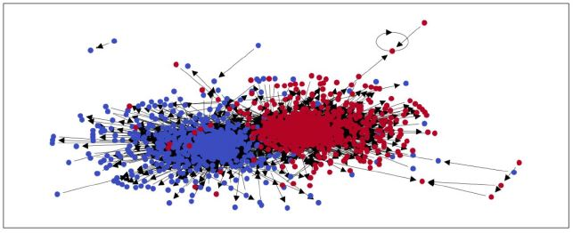
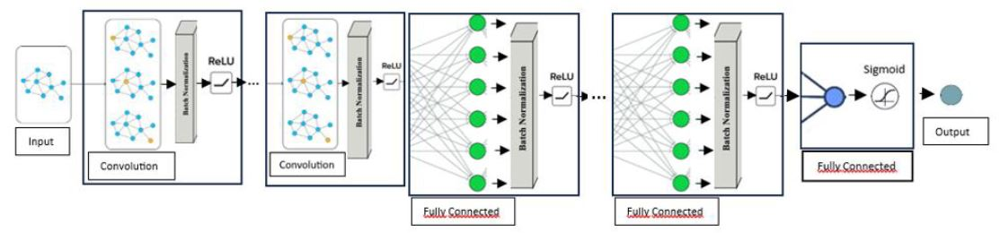
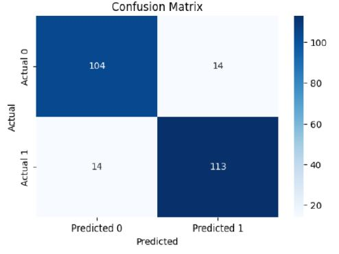
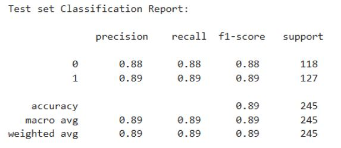

# Political blogs classification using Graph Convolutional Networks (GCNs)
The goal of this project is to classify political blogs as either **liberal or conservative** using the **Polblogs dataset**.  
The dataset used is the one recorded and analysed in the paper [The political blogosphere and the 2004 US Election](https://dl.acm.org/doi/10.1145/1134271.1134277) proposed in 2005, which contains a collection of the political blogs that were most active in 2004 in the run-up to the US presidential election.  
This dataset not only includes metadata about individual blogs but also captures the **hyperlinks between** them, forming a **graph structure** that reflects the networked nature of political discourse.

<div align="center">
  
</div>

## 📁 Project Structure

```
TE_GCN_Polblogs
│
|── 📁 static/                         # Folder to store example images
├── best_model_full.pth                 # Weights of the best model
├── best_model_full.pth                 # Weights of the best model trained ignoring outliers
├── LICENSE                             # Apache 2.0 License
├── polblogs_embeddings.csv             # Text embeddings generated with BERT from text scraped from Polblogs         
└── README.md                           # Project README
└── TEC_GCN.ypnb                        # Jupyter notebook with source code for data pre-processing, model training and evaluation
```

## 📬 Key Features

**Text embedding generation**    
The Polblogs dataset is processed with BERT to obtain text embeddings in order to feed the GCN

**New architecture proposed**  
A novel architecture is introduced to leverage GCN and adapt them to this dataset

<div align="center">
  
</div>

**Metric evaluation on test set**  
After training the model, evaluation metrics were computed on the train set. Here are showed results.

<div align="center">
  
</div>

<div align="center">
  
</div>

## 🚀 Usage

1. Clone the repository:
```bash
git clone https://github.com/GiuseppeFarano/polblogs-classification-with-GCN.git
cd polblogs-classification-with-GCN
 ```
2. Load the TE_GCN.ypnb script in order to interact with the data and the model
---

## 🪪 License

This project is distributed under the Apache 2.0 License

---

## 👨‍💻 Author

- Giuseppe Farano
---

This project was developed for educational purposes as part of a university course.  
If you're looking for a broader overview of the methodology and technologies used, check out the [project presentation](static/presentation.pdf).   
For a more detailed and technical explanation, refer to the [technical report](static/technical_report.pdf).
